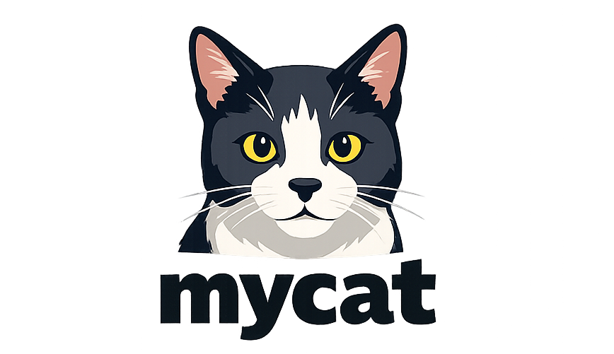

# mycat


<p align="center">
  
</p>


I think every programmer ends up, at some point, reimplementing something classic from Unix, whether as an exercise, curiosity, or a way to understand the "why" behind how things actually work. For me, that turned into **mycat**, a reimplementation of the `cat` command written in pure C11.

It's minimal by design, but also strict, modular, and meant to behave like real software (not just a "toy" program). I wanted to see how far I could go while keeping the code explicit, readable, and correct.

## Overview

`mycat` is a from-scratch clone of the Unix `cat` utility. It doesn't try to reinvent it; the goal is to rebuild it properly, step by step, focusing on control, modularity, and predictable behavior.  

Internally, it's split into clear layers:
- Argument parsing and flag handling.  
- Stream and file processing.  
- Main control and orchestration.  

Each part is clean, independent, and easy to navigate. That's how I like to structure C projects: **one file has one job**.

## Features

- **C11** implementation  
- **Modular design**: clear separation between logic layers  
- **Strict build rules** with `-Wall -Wextra -Wpedantic -Werror`  
- **Stream-by-stream** file processing (`fgetc`, `fputc`)  
- **Explicit runtime diagnostics** for invalid options and I/O failures
- Support for:
  - standard input and explicit `-`
  - multiple files in sequence
  - grouped short options
- Options available:
  - `-n` → number all lines  
  - `-b` → number only non-empty lines (overrides `-n`)  
  - `-E` → show `$` at end of each line  
  - `-T` → show tabs as `^I`
  - `-C` → prefix each output line with `🐱`
  - `-c` → print one `🐱` line before all output

Grouped flags like `-nET` and `-bE` are fully supported.

## Project Structure

```
mycat/
├── bin/                  # Compiled binary and local test files
│   ├── mycat
│   ├── blank.txt
│   ├── tab.txt
│   └── teste.txt
├── build/                # Object files
│   ├── main_mycat.o
│   ├── mycat.o
│   └── mycat_options.o
├── include/
│   ├── mycat.h
│   └── mycat_options.h
├── mycat-lang/            # Separate toy language project
│   ├── Makefile
│   ├── GUIDE.md
│   ├── README.md
│   ├── examples/
│   │   └── demo.mcl
│   └── src/
│       └── main.c
├── src/
│   ├── main_mycat.c
│   ├── mycat.c
│   └── mycat_options.c
├── LICENSE             
├── Makefile
├── mycat.png
└── README.md
```

## Build

From the root directory:

```bash
make
```

The compiled binary will be available at:

```
bin/mycat
```

For a clean rebuild:

```bash
make clean
```

## Usage

```bash
./bin/mycat [OPTIONS] [FILE...]
```

Behavior:
- If no file is specified, input is read from `stdin`.  
- Multiple files are concatenated sequentially.  
- If one file fails, `mycat` reports the error, keeps processing remaining files, and exits with failure status.  
- A lone `-` reads explicitly from `stdin` at that point.

### Examples

```bash
./bin/mycat file.txt
./bin/mycat -n file.txt
./bin/mycat -b file.txt
./bin/mycat -ET file.txt
./bin/mycat -C file.txt
./bin/mycat -c -C file.txt
./bin/mycat -n file1.txt file2.txt
./bin/mycat -n -
```

## mycat-lang (separate project)

There is now a separate toy language project in `mycat-lang/`, with:
- variables
- arithmetic
- `if` / `else` / `while` blocks using `end`
- string printing (including emoji like `🐱`)

Quick run:

```bash
cd mycat-lang
make
./bin/mycat-lang examples/demo.mcl
```

Language guide: `mycat-lang/GUIDE.md`

Pipeline-friendly examples:

```bash
./bin/mycat -C file.txt | awk -F'\t' '{print $2}'
./bin/mycat -C file.txt | perl -F'\t' -lane 'print $F[1]'
```

## Implementation Notes

### 1. Modular layout
The sources are organized into three main parts:

- `main_mycat.c` → entry point and control flow  
- `mycat_options.c` → option parsing  
- `mycat.c` → stream and file logic  

This keeps the program easy to extend. Each layer knows exactly what it's responsible for.

### 2. Stream-level processing
The core part works directly with `FILE *` streams instead of raw paths. That means the same function works for both real files and `stdin`, which makes the code simpler and more flexible.

Processing is done character by character using `fgetc`, which allows precise control over line numbering, tab visualization, and end-of-line markers.

### 3. State tracking
The internal state keeps track of whether we're at the start of a line, that's how numbering decisions are made.  
- `-n` → numbers every line  
- `-b` → numbers only non-empty lines and takes precedence over `-n`

### 4. Output handling
Nothing implicit here. Output uses only `fputc`, `fputs`, and `snprintf` for formatting. It makes the behavior explicit and fully observable.

### 5. Error handling
Return values are defined constants:
- `MYCAT_OK`  
- `MYCAT_ERR_INVALID_ARG`  
- `MYCAT_ERR_IO`

When something fails, it fails early, no silent behavior, no undefined states.

## Compilation Discipline

Strict flags are enabled by default:

```
-Wall -Wextra -Wpedantic -Werror -std=c11
```

It forces clean, portable code and makes warnings impossible to ignore.

## Current Status

**Implemented:**
- Grouped short-option parsing  
- `stdin` and `-` handling  
- Multiple file concatenation  
- `-n`, `-b`, `-E`, `-T`, `-C`, and `-c`  
- Proper precedence of `-b` over `-n`

**Planned ideas:**
- Shared base for future Unix-style tools  
- Unified multi-tool build system  
- Expansion toward closer POSIX behavior

## Design Philosophy

I care about simplicity, not shortcuts.  
Everything here is explicit: how it's built, how it runs, and how it fails.  
C projects are like that: the language forces you to be clear, honest, and intentional.  
That's what this project is about.

## Educational Note

This repository intentionally includes compiled object files (`.o`) inside the `build/` directory.
This is done for educational purposes, to expose the compilation pipeline and intermediate artifacts when working with C and Makefiles.
In production environments, these files are typically ignored.

## License

MIT License — see [LICENSE](LICENSE) file.
